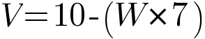

# Follow_the_line
[Unibotics](https://unibotics.org) exercice [visual follow line](https://unibotics.org/academy/exercise/follow_line/)

#### 👨‍🎓 This project was carried out during my master's degree in computer vision at URJC - Madrid 

Here you will find my solution to the "[visual follow line](https://unibotics.org/academy/exercise/follow_line/)" exercise.

The goal of this one is to realize an algorithm allowing a formula 1 to be autonomous.

## Website

You can find more information about my project here : [My website](https://poubelle2604.wixsite.com/luis-2022-robotica/visual-follow-line)

## Goals

- Making Formula 1 autonomous
- Carrying out the circuits without having an accident
- Complete the circuits as quickly as possible

## Requirements

* Python 3.7+
* [Unibotics](https://unibotics.org) account
* Go to [this website](https://unibotics.org/academy/exercise/follow_line/)


* numpy == 1.21
* opencv_python == 4.5.5
* GUI == 0.0.1 (custom library)
* HAL == 0.0.3 (custom library)

How to install all the requirements (GUI and HAL) :
```bash
$ docker pull jderobot/robotics-academy:latest
```
```bash
$ docker run --rm -it -p 8000:8000 -p 2303:2303 -p 1905:1905 -p 8765:8765 -p 6080:6080 -p 1108:1108 jderobot/robotics-academy
```
Wait for the Connect button to turn green and display “Connected”. Click on the “Launch” button and wait for some time until an alert appears with the message Connection Established and button displays “Ready”.

###### For more information : [website](https://unibotics.org/academy/exercise/follow_line/) (in instructions section). 

## Usage

Copy and paste ```src/Follow_line.py``` in the code section of the website exercise.

## Project details

We are going to solve this exercise using the Unibotics website (unibotics.org). 

This gives us access to a code editor and a simulator where we can see the result of it. You can find the exercise link below.

We therefore have a Formula 1 simulator available. The goal is to finish the circuit as quickly as possible while following a red line drawn on the ground.

For this we have access to the images of a camera equipped on formula 1. To direct formula 1 we can also change two parameters which are: the speed and the rotation of formula 1

There is two important aspects of robotics which are: the robustness of the program and its execution time (should be real time).


## The simulator

Some images about the simulator

<p align="center">
  
</p>

## My solution

### 1. Detect the line

To begin with, I therefore decided to use a **color filter** to detect the red line that formula1 **must follow**.
For that I have to recover the image of the camera placed on the car.
I then pass this image in HSV format and use a color filter with the parameters : 0 < H < 179, 195 < S < 255 and 200 < V < 230.

To find these parameters I used a program that I made.
This program allows you to play with the hsv parameters and to see the rendering live, like so :

<p align="center">
  
</p>

### 2. Detect the optimal path

In this second step my goal is to find the **optimal path** that the car should take.

I decided to represent this optimal path with a straight line. 
From a point called "start" to a point called "end". The "start" point will represent the front middle of formula 1.
And the "end" point will represent **where the car should go**.

For the "end" point I decided to take as reference the furthest point of the line that we can see.
To do so I analyze the image from top to bottom (line by line) and stopped when a group of pixels representing the line is found.

I decided to take a minimum pixel size and not one single pixel to avoid detecting possible errors due to the color filter.
What makes my robot more robust.

During the development of this step I choosed to represent this line in order to verify that my calculations were correct.

<p align="center">
  
</p>

<p align="center">
  <i>Here the blue line is representing the optimal path and the dots are representing the "start" and "end" point</i>
</p>

### 3. Controling the car

This simulator gives us access to two parameters : the speed and direction of the car (the steering wheel).
For the direction (which we will denote W) we will use a PID controller

PID controller stands for Proportional Integral Derivative, and it is a type of device used to control different process variables such as pressure, flow, temperature and speed in industrial applications. In this controller, a control loop feedback device is used to regulate all process variables.

Here we will only use the P and D controllers of the PID controller.

For the PD controller we used this formula :

<p align="center">
    
</p>

The result obtained from this formula will be used to control the steering wheel direction.
Thanks to the PD controller we can adjust the intensity of the rotation of the car.

Once the rotation of the car has been calculated, we will deduce its speed (named v). Here is a representative formula of this one :

<p align="center">
    
</p>

As we can see the speed depends on the rotation of the car (v depends on the parameter w).

This means that the more the car turns, or plans to turn, the more its speed will decrease.
And on the contrary, the straighter the line is (the wheels are straight), the more the speed increases.

### 4. Exceptions

When developing a robot, there are two characteristics that should not be overlooked: **Speed and robustness**.
In order to increase the robustness of this algorithm, I decided to implement an error handling when the camera does not detect a line.
When this happens the car slows down and turns on itself until it finds a line.

### 5. Results

I used python3 to develop this algorithm.
I tried to do a code that can be understood by anyone. You can find my code on github, down bellow.
Here are the results I got based on the circuit:

[](https://www.youtube.com/watch?v=vmA412SsqdQ&ab_channel=Luis)

## Structure

    .
    ├── imgs
    │    ├── circuit_1.png
    │    ├── circuit_2.jpeg
    │    ├── formula_1.png
    │    ├── formula_2.png
    │    ├── hsv_finder.png
    │    └── youtube.png
    ├── README.md
    └── src
        └── Follow_line.py

## Authors

* **Luis Rosario** - *Member 1* - [Luisrosario2604](https://github.com/Luisrosario2604)
